# test-webapi
webapiの検証を行う
- Google Drive API
- Google Spread Sheet API

## 目次
- [GCPアカウント登録](#01)
- [プロジェクトの作成](#02)
- [APIの有効化](#03)
- [サービスアカウントの作成](#04)
- [GCPアカウント権限追加](#05)
- [サービスアカウントの秘密鍵作成](#06)

## GCPアカウント登録

1. Google Cloudの[公式サイト](https://console.cloud.google.com/)へアクセスし、Googleアカウントでコンソールにログインする

    ※事前にGoogleアカウントを発行しておく必要がある

1. `無料トライアルを試す`を有効化すると、アカウントの指定、国、利用規約への同意、請求情報の設定を行う

    ※無料トライアル期間が終了しても自動的に請求は行われない

## プロジェクトの作成

1. 右上のGoogle Cloudのロゴの隣りに`My First Project`をクリックする

    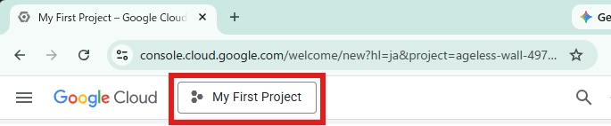

1. `新しいプロジェクト`をクリックする

    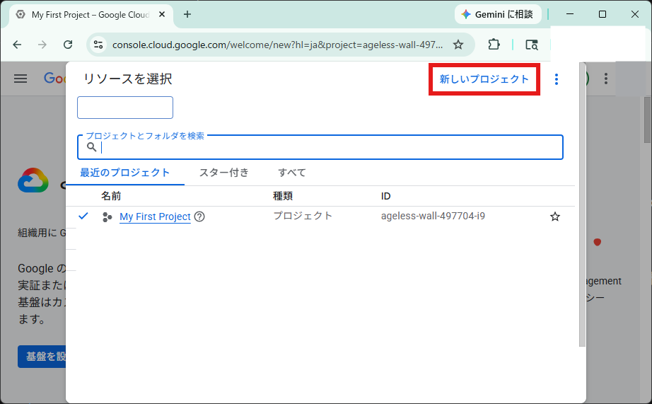

1. `プロジェクト名(trainning-python)`、`組織`、`親リソース`を指定して`作成`ボタンをクリックするとプロジェクトが作成される

    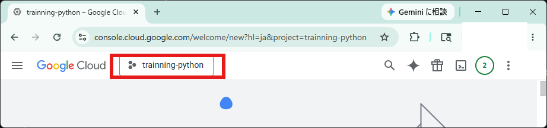

## APIの有効化

1. `APIとサービス` > `有効なAPIとサービス`へアクセスし、`APIとサービスを有効にする`をクリックする

    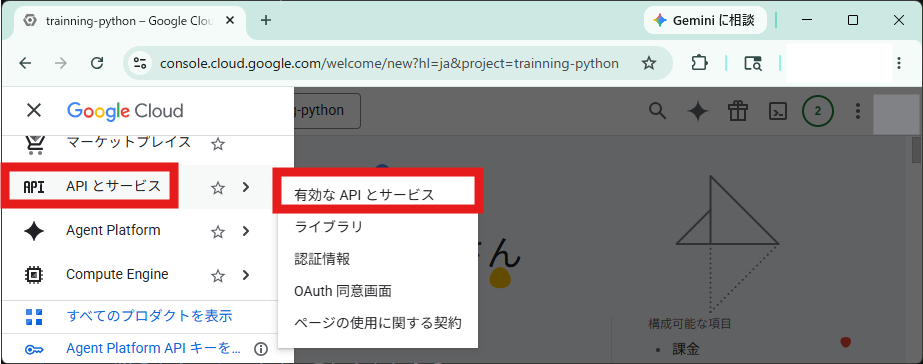

    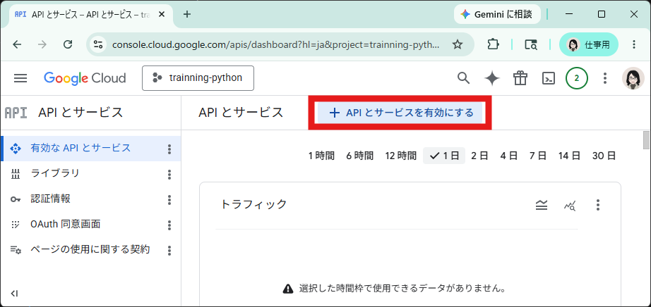

1. `Google Drive API`と`Google Sheet API`の有効を行う

## サービスアカウントの作成

1. `APIとサービス` > `認証情報`へアクセスし、`認証情報を作成`をクリックする

    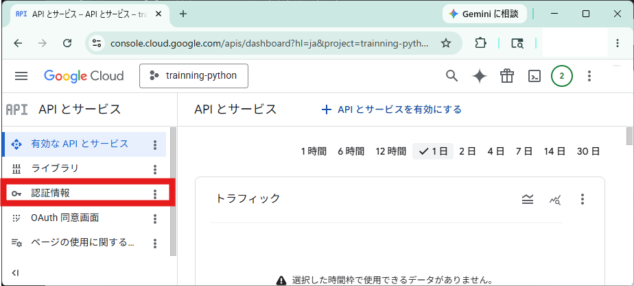

    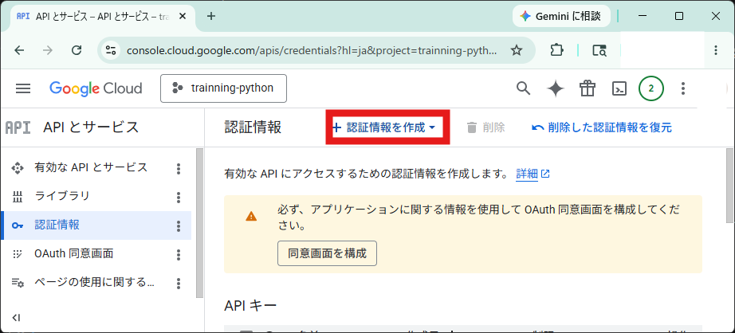

1. `サービスアカウント`を選択する

    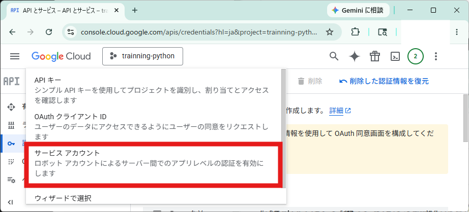

1. `サービスアカウント名`を入力し、`作成して続行`をクリックする

    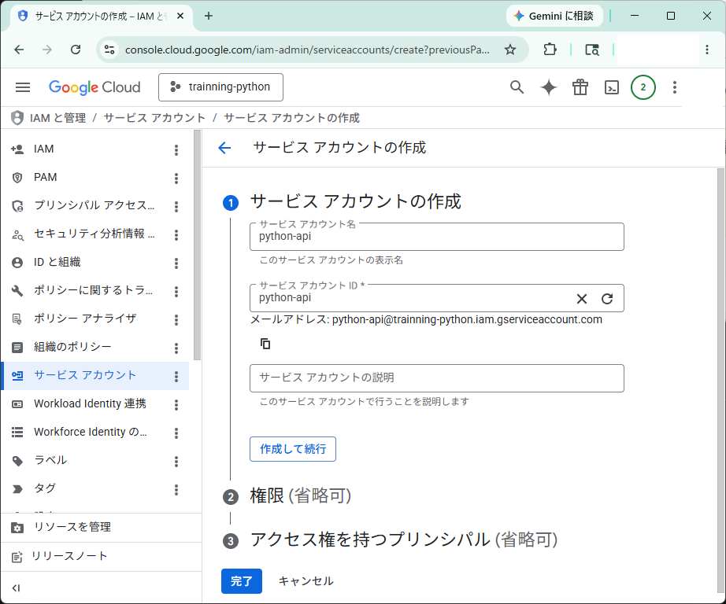

1. `権限ロール`を`編集者`と選択し`続行`をクリックする

    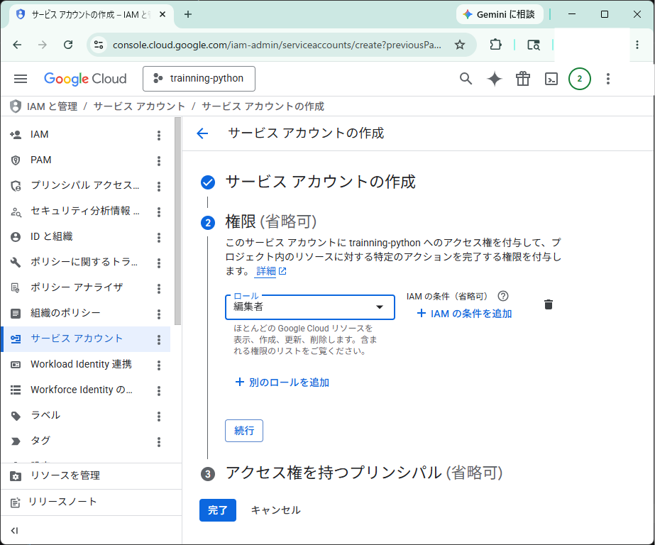

1. `アクセス権を持つプリンシパル（省略可）`は特に指定せず`完了`ボタンをクリックする

    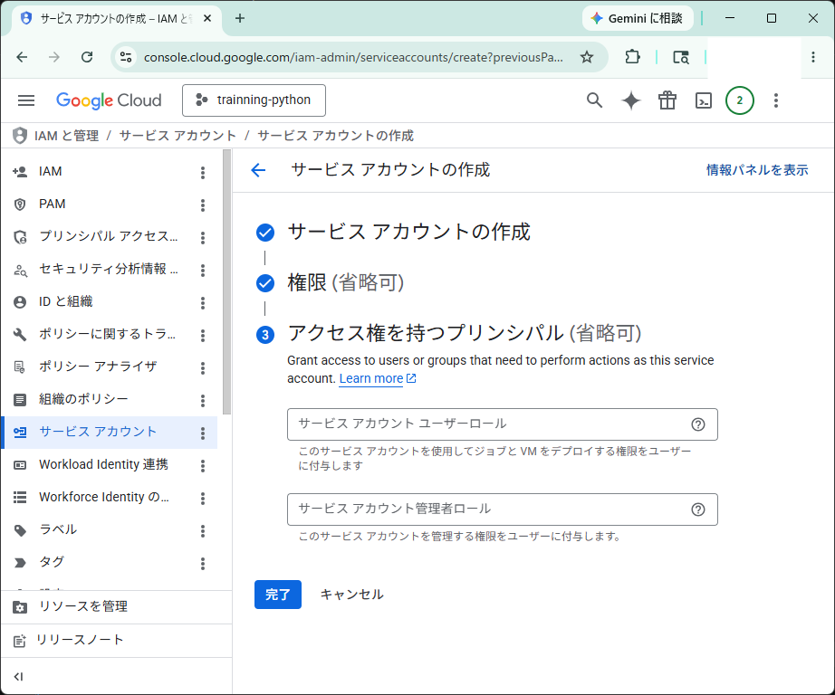

    サービスアカウントが作成される

    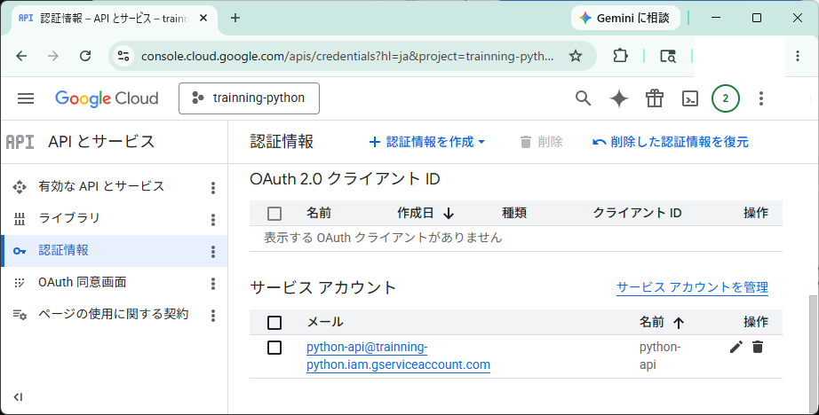

## アカウント権限追加

GCPアカウントのデフォルトの権限では、`サービスアカウント キーの作成を無効にする`が`有効化`されているため、`無効化`にする必要がある

1. `プロジェクト`で`組織`を選択し`[IAM と管理]` ＞ `[IAM]`へアクセスする
1. 権限付与するアカウントの`編集`をクリックし、`別のロールを追加`をクリックし、`組織ポリシー管理者`を選択して`保存`する
1. `[IAM と管理]` ＞ `[組織のポリシー]`へアクセスし、フィルタに `iam.disableServiceAccountKeyCreation`と入力する
1. 抽出された`iam.disableServiceAccountKeyCreation`をクリックし`ポリシーを管理`をクリックする
1. `ルール`の編集で適用`オン`を`オフ`に切り替え`ポリシーを設定`をクリックする

    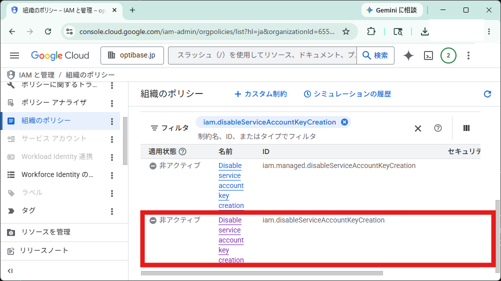

    適用状態が非アクティブとなっていれば成功！

## サービスアカウントの秘密鍵作成

1. 作成したサービスアカウントを選択し`鍵`タグへアクセスし、`キーを追加`で`新しい鍵を作成`をクリックする

    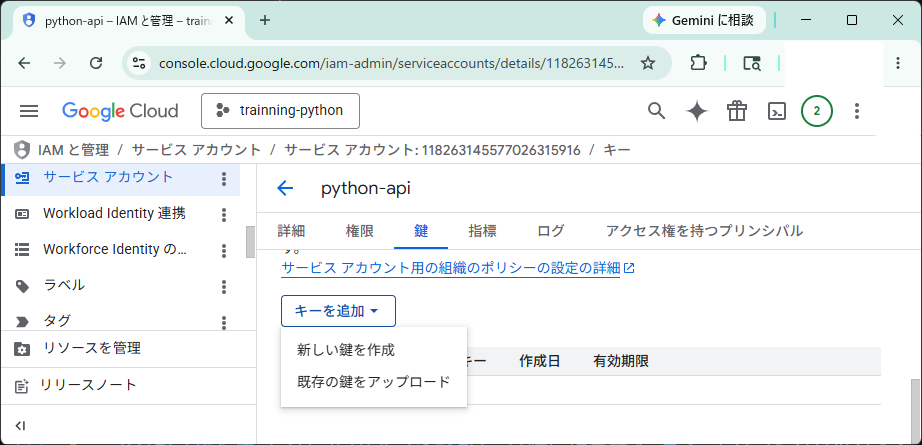

1. `キーのタイプ`をデフォルトの`JSON`のまま`作成`をクリックする

    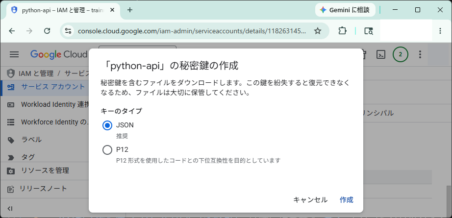

    秘密鍵がパソコンに保存されたメッセージと共に、JSON形式のファイルがダウンロードされる

    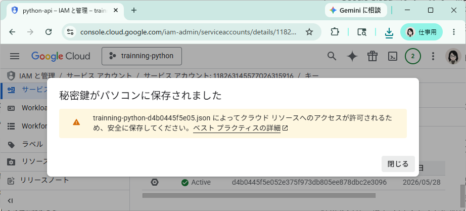

    ダウンロードフォルダを確認するとJSONファイルが存在していることが確認できる

    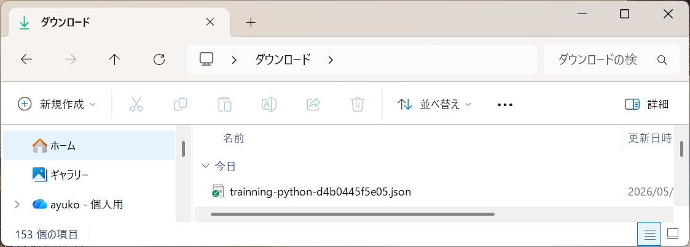