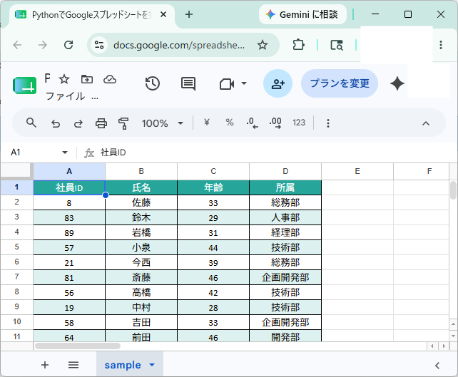
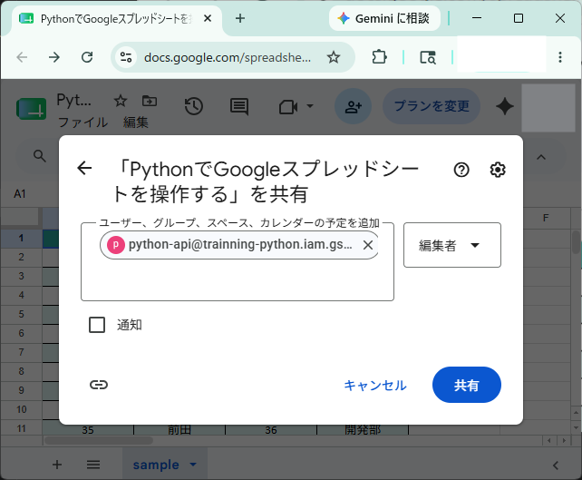
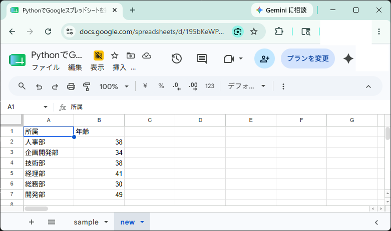

# test-webapi
webapiの検証を行う
- Google Drive API
- Google Spread Sheet API

## 目次
[第一章 GCP設定](#1)
- [GCPアカウント登録](#01)
- [プロジェクトの作成](#02)
- [APIの有効化](#03)
- [サービスアカウントの作成](#04)
- [GCPアカウント権限追加](#05)
- [サービスアカウントの秘密鍵作成](#06)

[第二章 Python環境設定](#2)
- [仮想環境](#07)
- [設定ファイル](#08)

[第三章 Googleスプレッドシートを操作する](#3)
- [認証情報読み込み](#09)
- [Googleスプレッドシートを操作する](#10)

<a id="1"></a>

## 第一章 GCP設定

<a id="01"></a>

### GCPアカウント登録

1. Google Cloudの[公式サイト](https://console.cloud.google.com/)へアクセスし、Googleアカウントでコンソールにログインする

    ※事前にGoogleアカウントを発行しておく必要がある

1. `無料トライアルを試す`を有効化すると、アカウントの指定、国、利用規約への同意、請求情報の設定を行う

    ※無料トライアル期間が終了しても自動的に請求は行われない

<a id="02"></a>

### プロジェクトの作成

1. 右上のGoogle Cloudのロゴの隣りに`My First Project`をクリックする

    

1. `新しいプロジェクト`をクリックする

    

1. `プロジェクト名(trainning-python)`、`組織`、`親リソース`を指定して`作成`ボタンをクリックするとプロジェクトが作成される

    

<a id="03"></a>

### APIの有効化

1. `APIとサービス` > `有効なAPIとサービス`へアクセスし、`APIとサービスを有効にする`をクリックする

    

    

1. `Google Drive API`と`Google Sheet API`の有効を行う


<a id="04"></a>

### サービスアカウントの作成

1. `APIとサービス` > `認証情報`へアクセスし、`認証情報を作成`をクリックする

    

    


1. `サービスアカウント`を選択する

    

1. `サービスアカウント名`を入力し、`作成して続行`をクリックする

    

1. `権限ロール`を`編集者`と選択し`続行`をクリックする

    

1. `アクセス権を持つプリンシパル（省略可）`は特に指定せず`完了`ボタンをクリックする

    

    サービスアカウントが作成される

    


<a id="05"></a>


### アカウント権限追加

GCPアカウントのデフォルトの権限では、`サービスアカウント キーの作成を無効にする`が`有効化`されているため、`無効化`にする必要がある

1. `プロジェクト`で`組織`を選択し`[IAM と管理]` ＞ `[IAM]`へアクセスする
1. 権限付与するアカウントの`編集`をクリックし、`別のロールを追加`をクリックし、`組織ポリシー管理者`を選択して`保存`する
1. `[IAM と管理]` ＞ `[組織のポリシー]`へアクセスし、フィルタに `iam.disableServiceAccountKeyCreation`と入力する
1. 抽出された`iam.disableServiceAccountKeyCreation`をクリックし`ポリシーを管理`をクリックする
1. `ルール`の編集で適用`オン`を`オフ`に切り替え`ポリシーを設定`をクリックする

    

    適用状態が非アクティブとなっていれば成功！

<a id="06"></a>

### サービスアカウントの秘密鍵作成

1. 作成したサービスアカウントを選択し`鍵`タグへアクセスし、`キーを追加`で`新しい鍵を作成`をクリックする

    

1. `キーのタイプ`をデフォルトの`JSON`のまま`作成`をクリックする

    

    秘密鍵がパソコンに保存されたメッセージと共に、JSON形式のファイルがダウンロードされる

    

    ダウンロードフォルダを確認するとJSONファイルが存在していることが確認できる

    


<a id="2"></a>

## 第二章 Python環境設定

<a id="07"></a>

### 仮想環境

1. Pythonがインストールされていることを確認する

    PowerShellのターミナル上で以下コマンドを実行する

    ```
    python --version
    ```
    ```
    Python 3.13.3
    ```

1. 仮想環境を作成する

    PowerShellのターミナル上で以下コマンドを実行する

    ```
    python -m venv venv
    ```

    `test-webapi`リポジトリ直下に`venv`フォルダが自動生成されれば成功！

1. 仮想環境に入る

    PowerShellのターミナル上で以下コマンドを実行する

    ```
    .\venv\Scripts\activate
    ```
    
    仮想環境に入ると以下のように表示される

    ```
    (venv) PS C:\Users\user\Documents\github\test-webapi>
    ```

1. `.env`ファイルを読み込むパッケージ`python-dotenv`をインストールする

    PowerShellのターミナル上で以下コマンドを実行する

    ```
    pip install python-dotenv,pandas,gspread,gspread-dataframe,gspread-formatting
    ```
    
    正常にインストールされたかどうか確認する
    
    ```
    pip list
    ```
    
    次の通り表示されれば成功

    ```
    Package              Version
    -------------------- -----------
    certifi              2026.5.20
    cffi                 2.0.0
    charset-normalizer   3.4.7
    cryptography         48.0.0
    google-auth          2.53.0
    google-auth-oauthlib 1.4.0
    gspread              6.2.1
    gspread-dataframe    4.0.0
    gspread-formatting   1.2.1
    idna                 3.17
    numpy                2.4.6
    oauthlib             3.3.1
    pandas               3.0.3
    pip                  26.1.1
    pyasn1               0.6.3
    pyasn1_modules       0.4.2
    pycparser            3.0
    python-dateutil      2.9.0.post0
    python-dotenv        1.2.2
    requests             2.34.2
    requests-oauthlib    2.0.0
    six                  1.17.0
    tzdata               2026.2
    urllib3              2.7.0
    ```

1. パッケージインストール情報をファイル化する

    PowerShellのターミナル上で以下コマンドを実行する

    ```
    pip freeze > requirements.txt
    ```

    `requirements.txt`が作成され、中身を確認すると`pip list`で表示されたパッケージが記載されていれば成功！


<a id="08"></a>

### 設定ファイル

1. 設定ファイルの`.env`ファイルを作成する

    pythonの設定ファイル`.env`に秘密鍵を記載する

    .env
    ```
    # 認証情報の設定
    CREDENTIAL_FILE="trainning-python-d4b0445f5e05.json"
    CREDENTIAL_PATH="./credentials/${CREDENTIAL_FILE}"
    ```

1. `main.py`を作成し設定ファイルが読み込めるか確認する

    `main.py`

    ```
    import os
    from dotenv import load_dotenv

    def init():

        # .envファイルの内容を環境変数に読み込む
        load_dotenv()

        # os.getenv() を使って値を取得する
        credential_key = os.getenv("CREDENTIAL_PATH")

        return credential_key

    def get_auth():
        pass

    def main():
        credential_key = init()
        print(credential_key)

    if __name__ == "__main__":
        main()

    ```

    `main.py`を実行する

    ```
    python main.py
    ```

    次の通り表示されれば成功！

    ```
    ./credentials/trainning-python-d4b0445f5e05.json
    ```
<a id="3"></a>

## 第三章 Googleスプレッドシートを操作する

<a id="09"></a>

### 認証情報読み込み

1. 認証情報の読み込みを確認する

    [gspread公式ドキュメント](https://docs.gspread.org/en/latest/oauth2.html)を参照して認証情報を読み込む

    `main.py`
    
    ```
    import os
    from dotenv import load_dotenv
    import gspread
    from google.oauth2.service_account import Credentials

    def init():

        # .envファイルの内容を環境変数に読み込む
        load_dotenv()

        # os.getenv() を使って値を取得する
        credential_key = os.getenv("CREDENTIAL_PATH")

        return credential_key

    def get_auth(credential_key):
        scopes = [
            'https://www.googleapis.com/auth/spreadsheets',
            'https://www.googleapis.com/auth/drive'
        ]

        credentials = Credentials.from_service_account_file(credential_key,scopes=scopes)

        gc = gspread.authorize(credentials)

        return gc

    def main():
        credential_key = init()
        print(credential_key)

        gs_credential = get_auth(credential_key)
        print(gs_credential)

    if __name__ == "__main__":
        main()
    ```

    次の通り表示できれば認証情報の読み込みが成功！

    ```
    ./credentials/trainning-python-d4b0445f5e05.json
    <gspread.client.Client object at 0x000002882552D6A0>
    ```

1. サンプルのGoogleスプレッドシートにサービスアカウントを共有設定する

    サンプルのGoogleスプレッドシート

    

    サービスアカウントを共有設定する

    

<a id="10"></a>

### Googleスプレッドシートを操作する

1. サンプルのGoogleスプレッドシートを読み込む

    `main.py`

    ```
    import os
    from dotenv import load_dotenv
    import gspread
    from google.oauth2.service_account import Credentials
    from gspread.client import Client
    import pandas as pd

    def init():
        # .envファイルの内容を環境変数に読み込む
        load_dotenv()

        # os.getenv() を使って値を取得する
        credential_key = os.getenv("CREDENTIAL_PATH")
        spread_id = os.getenv("SPREAD_ID")
        sheet_name = os.getenv("SHEET_NAME")

        setting = {
            "credential_key":credential_key,
            "spread_id":spread_id, 
            "sheet_name": sheet_name
        }
        return setting

    def get_auth(credential_key:str) -> Client:
        scopes = [
            'https://www.googleapis.com/auth/spreadsheets',
            'https://www.googleapis.com/auth/drive'
        ]

        credentials = Credentials.from_service_account_file(credential_key,scopes=scopes)

        gc = gspread.authorize(credentials)

        return gc

    def read_spread(gs_credential:Client, spread_id:str, sheet_name:str):
        spread = gs_credential.open_by_key(spread_id)
        spread_sheet = spread.worksheet(sheet_name)
        datas = spread_sheet.get_all_values()
        df = pd.DataFrame(datas[1:],columns=datas[0])
        print(df)

    def main():
        setting = init()
        gs_credential = get_auth(setting["credential_key"])
        read_spread(gs_credential, setting["spread_id"], setting["sheet_name"])

    if __name__ == "__main__":
        main()
    ```

    `main.py`を実行して以下の通り表示されれば成功！

    ```
      社員ID  氏名  年齢     所属
    0   93  佐藤  46    総務部
    1   58  鈴木  32    人事部
    2   10  岩橋  42    経理部
    3   64  小泉  34    技術部
    4   10  今西  49    総務部
    5    2  斎藤  24  企画開発部
    6   74  高橋  40    技術部
    7   68  中村  31    技術部
    8   75  吉田  31  企画開発部
    9   89  前田  22    開発部
    ```

1. 所属毎の年齢の平均値を集計する

    `main.py`

    ```
    import os
    from dotenv import load_dotenv
    import gspread
    from google.oauth2.service_account import Credentials
    from gspread.client import Client
    import pandas as pd

    def init():
        # .envファイルの内容を環境変数に読み込む
        load_dotenv()

        # os.getenv() を使って値を取得する
        credential_key = os.getenv("CREDENTIAL_PATH")
        spread_id = os.getenv("SPREAD_ID")
        sheet_name = os.getenv("SHEET_NAME")

        setting = {
            "credential_key":credential_key,
            "spread_id":spread_id, 
            "sheet_name": sheet_name
        }
        return setting

    def get_auth(credential_key:str) -> Client:
        scopes = [
            'https://www.googleapis.com/auth/spreadsheets',
            'https://www.googleapis.com/auth/drive'
        ]

        credentials = Credentials.from_service_account_file(credential_key,scopes=scopes)

        gc = gspread.authorize(credentials)

        return gc

    def read_spread(gs_credential:Client, spread_id:str, sheet_name:str) -> pd.DataFrame:
        spread = gs_credential.open_by_key(spread_id)
        spread_sheet = spread.worksheet(sheet_name)
        datas = spread_sheet.get_all_values()
        df = pd.DataFrame(datas[1:],columns=datas[0])
        df = df.astype({"社員ID":int, "年齢":int})
        return df

    def get_department_average(df:pd.DataFrame):
        df_ave = df.groupby(df["所属"])["年齢"].mean().round().astype(int)
        print(df_ave)

    def main():
        setting = init()
        gs_credential = get_auth(setting["credential_key"])
        df = read_spread(gs_credential, setting["spread_id"], setting["sheet_name"])
        get_department_average(df)

    if __name__ == "__main__":
        main()
    ```

    `main.py`を実行して以下の通り表示されれば成功！

    ```
    所属
    人事部      37
    企画開発部    44
    技術部      45
    経理部      28
    総務部      47
    開発部      35
    Name: 年齢, dtype: int64
    ```

1. `pivot_table`を使用して所属毎の年齢の平均値を集計する

    `main.py`

    ```
    import os
    from dotenv import load_dotenv
    import gspread
    from google.oauth2.service_account import Credentials
    from gspread.client import Client
    import pandas as pd

    def init():
        # .envファイルの内容を環境変数に読み込む
        load_dotenv()

        # os.getenv() を使って値を取得する
        credential_key = os.getenv("CREDENTIAL_PATH")
        spread_id = os.getenv("SPREAD_ID")
        sheet_name = os.getenv("SHEET_NAME")

        setting = {
            "credential_key":credential_key,
            "spread_id":spread_id, 
            "sheet_name": sheet_name
        }
        return setting

    def get_auth(credential_key:str) -> Client:
        scopes = [
            'https://www.googleapis.com/auth/spreadsheets',
            'https://www.googleapis.com/auth/drive'
        ]

        credentials = Credentials.from_service_account_file(credential_key,scopes=scopes)

        gc = gspread.authorize(credentials)

        return gc

    def read_spread(gs_credential:Client, spread_id:str, sheet_name:str) -> pd.DataFrame:
        spread = gs_credential.open_by_key(spread_id)
        spread_sheet = spread.worksheet(sheet_name)
        datas = spread_sheet.get_all_values()
        df = pd.DataFrame(datas[1:],columns=datas[0])
        df = df.astype({"社員ID":int, "年齢":int})
        return df

    def get_department_average(df:pd.DataFrame)->pd.DataFrame:
        # df_ave = df.groupby(df["所属"])["年齢"].mean().round().astype(int)
        pvt_table = df.pivot_table(index=["所属"], values=["年齢"], aggfunc="mean")
        pvt_table["年齢"] = pvt_table["年齢"].round().astype(int)
        return pvt_table

    def main():
        setting = init()
        gs_credential = get_auth(setting["credential_key"])
        df = read_spread(gs_credential, setting["spread_id"], setting["sheet_name"])
        piv_talbe = get_department_average(df)
        print(piv_talbe)

    if __name__ == "__main__":
        main()
    ```

    `main.py`を実行して以下の通り表示されれば成功！

    ```
           年齢
    所属       
    人事部    23
    企画開発部  36
    技術部    37
    経理部    35
    総務部    32
    開発部    27
    ```

1. `pivot_table`を別シートに書き込む

    `main.py`
    ```
    import os
    from dotenv import load_dotenv
    import gspread
    from google.oauth2.service_account import Credentials
    from gspread.client import Client
    from gspread.spreadsheet import Spreadsheet
    from gspread.worksheet import Worksheet
    from gspread_dataframe import set_with_dataframe
    import pandas as pd

    def init():
        # .envファイルの内容を環境変数に読み込む
        load_dotenv()

        # os.getenv() を使って値を取得する
        credential_key = os.getenv("CREDENTIAL_PATH")
        spread_id = os.getenv("SPREAD_ID")
        sheet_name = os.getenv("SHEET_NAME")

        setting = {
            "credential_key":credential_key,
            "spread_id":spread_id, 
            "sheet_name": sheet_name
        }
        return setting

    def get_auth(credential_key:str) -> Client:
        scopes = [
            'https://www.googleapis.com/auth/spreadsheets',
            'https://www.googleapis.com/auth/drive'
        ]

        credentials = Credentials.from_service_account_file(credential_key,scopes=scopes)

        gc = gspread.authorize(credentials)

        return gc

    def get_spread(gs_credential:Client, spread_id:str)->Spreadsheet:
        spread = gs_credential.open_by_key(spread_id)
        return spread

    def get_spread_sheet(spread:Spreadsheet, sheet_name:str) -> Worksheet:
        return spread.worksheet(sheet_name)

    def read_spread(spread_sheet:Worksheet) -> pd.DataFrame:
        datas = spread_sheet.get_all_values()
        df = pd.DataFrame(datas[1:],columns=datas[0])
        df = df.astype({"社員ID":int, "年齢":int})
        return df

    def get_department_average(df:pd.DataFrame)->pd.DataFrame:
        pvt_table = df.pivot_table(index=["所属"], values=["年齢"], aggfunc="mean")
        pvt_table["年齢"] = pvt_table["年齢"].round().astype(int)
        return pvt_table

    def write_pivot_table(spread:Spreadsheet, piv_talbe:pd.DataFrame):
        new_spread_sheet = spread.add_worksheet(title="new", rows=100, cols=100)
        set_with_dataframe(worksheet=new_spread_sheet,dataframe=piv_talbe.reset_index(), row=1, col=1)

    def main():
        setting = init()
        gs_credential = get_auth(setting["credential_key"])
        spread = get_spread(gs_credential, setting["spread_id"])
        spread_sheet = get_spread_sheet(spread, setting["sheet_name"])
        df = read_spread(spread_sheet)
        piv_talbe = get_department_average(df)
        write_pivot_table(spread=spread, piv_talbe=piv_talbe)

    if __name__ == "__main__":
        main()
    ```

    以下の通りGoogleスプレッドシートに新しくシートが追加されていれば成功！

    